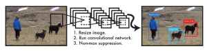
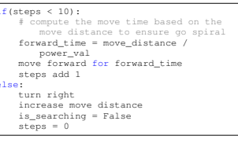
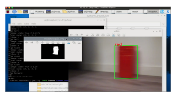
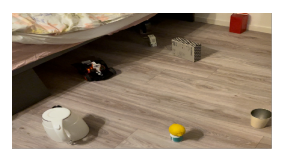
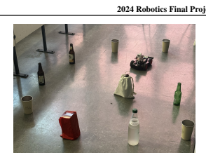

# 2024 Robotics Final Project Color-Based Object Detection
## Find a nicely formatted report 
## Team Ballobot: Shan Jiang Jiayi Wu Suju Li Pu Li Ruhao Han 

## Abstract

In this report, we present the development of an autonomous robotic system with object detection, spiral search, and obstacle avoidance. The system utilizes OpenCV for real-time image processing and Raspberry Pi for execution, focusing on colorbased object detection in the HSV color space.

Key innovations include a modular design that enables teammates to independently develop and test components, which improves collaboration efficiency, and the integration of a spiral search algorithm for comprehensive area coverage. The robot can identify and track objects based on color, adapting to various lighting conditions without extensive training datasets. This project lays a foundation for understanding autonomous robotics.

## 1. Introduction

Our project is capable of independently identifying and localizing colored items. Its primary purpose is to enable the robot to recognize and track things based on their color, as well as navigating them utilizing obstacle avoidance and spiral search strategies. The technology incorporates colorbased object detection and real-time obstacle avoidance to ensure that the robot can function autonomously in its environment with no human interaction.

The system is modular and easily expandable, with each component (object detection, obstacle avoidance, and search strategy) being built, tested, and improved separately. This modular design allows for easier maintenance and future updates while maintaining the system's overall functionality.

Technically, the project makes use of the open-source computer vision package OpenCV to process images and extract features for object detection and tracking. A Raspberry Pi with the Picamera2 module is utilized for real-time image collection and processing, making the system simple to use.

The entire system is written in Python, which includes a diverse variety of libraries and tools.

well-lit environments or poorly-lit ones, to see how well the system could recognize colorful items and avoid fixed obstacles in different indoor space. Thus the external environment can assesses the system's ability to recognize things and avoid obstacles under varying illumination conditions.

## 1.1. Novelty

The project implements a color-based object identification system that recognizes and tracks things in the HSV color space. This method automatically extracts object position information without human interaction or prior knowledge, simplifying the identification process and boosting accuracy under various illumination situations. The novelty here is:
- **Color adaptability**: The system can recognize numerous colors without requiring sophisticated training datasets or machine learning algorithms to identify multiple items.

- **Real-time processing**: Because the detecting system can process photos in real time, it is ideal for dynamic environments with fast changing objects and lighting conditions.

- **Simplicity and efficiency**: By utilizing predetermined color ranges and fundamental image processing algorithms, the system achieves great performance while incurring minimal computing overhead, which is crucial for embedded platforms like Raspberry Pi.

## 1.2. Related Work 1.2.1. Color-Based Object Detection

Color Histogram-Based Approach Swain and Ballard's
(1) work on color indexing with color histograms established the groundwork for color-based item recognition. They developed a robust technique for object recognition under various lighting situations using histogram matching in HSV
color space.

Real-Time Color Tracking Bradski's (2) method to developing the CamShift algorithm for real-time object tracking. The system dynamically resizes its search window, To evaluate the system, we also ran a series of tests to validate the related functions in various settings, such as indoor which is especially beneficial for tracking objects of varying sizes and shapes in real time.

## 1.2.2. Modular Robotic System

ROS (Robot Operating System) ROS provides a versatile framework for developing robotics software and popularizes the idea of robot modularity. The ROS philosophy, which supports the breakdown of robot functions into manageable, reusable modules, affected the project's architecture (3).

1.2.3. ROBOTIC SYSTEMS THAT USE VISION
Digital Image Processing Gonzalez and Woods' (4)
groundbreaking work in digital image processing provided the fundamentals for understanding the techniques employed in this study for picture analysis and object detection.

## 2. Design And Implementation

The system design includes four main parts: target recognition, search algorithm, obstacle avoidance mechanism and main control. The design idea of target recognition focuses on identifying the target object in the image through color detection. The search algorithm adopts a spiral path starting from the center point, which can fully cover the environment. For obstacle avoidance, robot is equipped with a radar sensor and an avoidance algorithm that continuously scans for obstacles and adjusts the robot's path to prevent collisions.

## 2.1. Target Detection 2.1.1. Attempt 1: Yolo

You Only Look Once (YOLO)1is a real-time object detection system. YOLO is faster and more accurate, and it's widely used in various fields such as autonomous driving and drones.

In the YOLO object detection system, the image size is first adjusted and processed through a convolutional neural network, generating a set of candidate bounding boxes with corresponding class probabilities. Then, Non-Maximum Suppression (NMS) is used to select the most representative bounding boxes, suppressing lesser or overlapping detections, thus achieving efficient and accurate object detection.

(As shown in figure 1) As YOLO has excellent performance in target detection, we were planning to use it combined with open-source models so that we can detect a greater variety and complexity of targets.

1More about YOLO can be found in YOLOv5.

However, due to the limitations of the Raspberry Pi version we were using, we found that the device does not have

the computational power required to run YOLO efficiently.

Additionally, we encountered many errors during the installation process, leading us to abandon this plan.

Figure 1. YOLO's Object Detection Principles

## 2.1.2. Attempt 2: Opencv

Then, we resorted to using color-based detection in OpenCV2 to recognize objects in the images captured by the robot's camera.

When we start the detection process, the camera continuously captures images of the environment. These captured images are converted into the HSV color space, and a threshold is applied to create binary masks that highlight the segments containing the specified color. We then refine the binary mask to reduce noise and draw contours representing the boundaries of the detected object. Lastly, we calculate the position of the target in the field of view. Returning 1 means the target is placed on the left side, 2 means it's in the middle, and 3 signifies it's on the right side.

## 2.2. Spiral Search Algorithm

The robot can search for specific objects in an environment where the target position is unknown. Starting from the center point, the robot moves in an ever-expanding spiral, systematically covering the entire area. This pattern ensures maximum coverage of the area. During the spiral movement, the robot also continues to detect the target object. The robot turns right every ten steps and then increases the distance of the next move to expand the search area. Each step stops to capture the latest image and calls the target recognition function to check if the target is in the field of view. The pseudo-code for the related logic is as follows:

 6 else:

## 2.3. Obstacle Avoidance

The robot's obstacle avoidance function in this project is realized by ultrasonic radar. Picar-4wd's radar will always scan the surrounding environment and measure the distance of objects from multiple angles by acoustic reflection to determine whether there are obstacles in the path. When the robot detects an obstacle within a certain range in the forward direction, it will adjust its trajectory to avoid collision.

Below is the pseudo-code related to the obstacle avoidance function:
1 if obstacle is detected and the target is not in vision.

2 obstacle_avoiding()
3 4 inside obstatcle_avoiding():
5 is_obstacled = True 6 while is_obstacled:
7 scan_list = get radar scan result.

8 if scan_list is empty:
9 continue 10 11 if obstacles are too close:
12 turn left 13 else: 14 is_obstacled = False

## 2.4. Main Control

The control module integrates the functions of object detection, spiral search and obstacle avoidance modules to coordinate the robot's movements. It makes real-time decisions based on sensor inputs and executes commands to control the robot's movements. Key Components and Workflow:
1 set the working mode of picamera2 2 while not touch the target.

3 img = get camera image 4 analyse img 5 avoid obstacles in front of the robot 6 if the target is in the vision.

7 adjust angle precisely to touch the target.

8 else:
9 operate spiral search.

## 3. Results

This section presents the robot's performance results, illustrating the usefulness of the developed algorithms and the overall performance of the system in various test scenarios.

Figure 2 gives an example of an object detection test.

## 3.1. Performance In Object Detection

Object recognition modules are evaluated based on their ability to reliably identify and track objects of different colors in a variety of lighting settings and environments.

Below is tabular data on the detection accuracy of different colors under different lighting conditions:

Table 1. Detection accuracy of different colors under different conditions

Sce.1 Run Col.2 Ltg.3 D.4(cm) Det.5(%) 1 50 Red Good6 10 100%

2 50 Red Good 25 98%

3 50 Red Good 40 96%

4 50 Red Poor 10 90%

5 50 Red Poor 25 88%

6 50 Red Poor 40 76%

7 50 Green Good 10 100%

8 50 Green Good 25 96%

9 50 Green Good 40 92%

10 50 Green Poor 10 86% 11 50 Green Poor 25 84% 12 50 Green Poor 40 72% 13 50 Blue Good 10 100%

14 50 Blue Good 25 98%

15 50 Blue Good 40 94%

16 50 Blue Poor 10 92%

17 50 Blue Poor 25 86%

18 50 Blue Poor 40 70%

1: Scenario 2: Color 3: Lighting 4: Distance 5: Detection rate 6: Good lighting is defined by lighting which is greater than 800 Lumens. Poor lighting means less than 600 Lumens.

Table 1 shows that the detection accuracy diminishes as the distance grows from 10 cm to 40 cm for all lighting conditions and colors. Second, insufficient illumination can reduce color detecting accuracy. While detection accuracy varied slightly by hue, red and blue items were more likely to be spotted than green things.

## 3.2. **Performance In Object Avoidance And Spiral Search**

The robotic system's performance in object avoidance and spiral search was measured in a variety of settings with vary-

| Table 2. Performance in Object Avoidance and Spiral Search. Sce.1 Obstacles2 Run3 Avg. Coll.4 Coll. Frq.5 1 0 5 1 0.2 2 5 5 3 0.6 3 10 5 6 1.2 1: Scenario   |
|--------------------------------------------------------------------------------------------------------------------------------------------------------------|

ing amounts of obstacles. The study focused on the system's capacity to maneuver without colliding with obstacles, as well as the spiral search pattern's effectiveness at locating objects. Table 2 summarizes the findings from these testing.

1 0 5 1 0.2

2 5 5 3 0.6

3 10 5 6 1.2

1: Scenario

2: The number of obstacles = [0, 5, 10]

3: We conducted 5 runs for each scenario. Each last for 5min. 4: Average collisions over 5 runs.

5: Collision frequency (/min) = Avg. Coll. / 5min

Even without barriers, the robot sometimes collided. This implies that there is potential for development in the robot's fundamental motion logic and environmental awareness.

Moderate obstacles (=5) give a moderate challenge, increasing the likelihood of crashes. This instance demonstrates that the robot can reasonably deal with a limited amount of impediments.

When there are 10 obstacles, the robot's collision frequency doubles, leading to a considerable loss in performance. This implies that present obstacle avoidance algorithms may require improvements to efficiently handle more complex and complicated settings.

## 3.3. Overall System Performance

The overall performance of the system is assessed by integrating the findings of the object detection and obstacle avoidance modules. The system was tested in a variety of real-world circumstances to determine its performance in autonomous searching and object tracking, as shown in Table 3.

The system was evaluated in hybrid settings that combined object detection and obstacle avoidance tasks. Each scenario was created to assess the system's ability to integrate numerous functions seamlessly.

In Scenario 1, the robot achieved a high success rate, completing all 20 runs.

In Scenario 2 as shown in Figure 3, the success rate fell to 90%, and the existence of impediments offered a moderate difficulty, resulting in some failures, presumably caused by collisions with obstructions.

In Scenario 3, the success rate dropped to 75%, with five failures recorded. The robot's ability to effectively navigate and detect targets was hampered by the poor lighting condi1 1 20 20 0 100%
2 2 20 18 2 90%
3 3 20 15 5 75%
4 4 20 12 8 60%
1: In this scenario, the robot is tested in an obstacle free, well-lit wood-floored indoor environment. 2: In this scenario, the robot is tested in a well-lit wood-floored indoor environment with 5 obstacles as shown in Figure 3. 3: In this scenario, the robot is tested in an obstacle free, poorly-lit wood-floored indoor environment.

4: In this scenario, the robot is tested in a poorly-lit woodfloored indoor environment with 5 obstacles.

5: A success is defined as the robot being able to go from the initial point until it touches the target object, without hitting an obstacle.

6: Success Rate = Success / Test Run

| Table 3. Overall System Performance                           |     |          |         |               |
|---------------------------------------------------------------|-----|----------|---------|---------------|
| Sce.                                                          | Run | Success5 | Failure | Success Rate6 |
| 1 1                                                           | 20  | 20       | 0       | 100%          |
| 2 2                                                           | 20  | 18       | 2       | 90%           |
| 3 3                                                           | 20  | 15       | 5       | 75%           |
| 4                                                             | 20  | 12       | 8       | 60%           |
| 4                                                             |     |          |         |               |
| 1: In this scenario, the robot is tested in an obstacle free, |     |          |         |               |

tions, resulting in a greater failure rate as compared to the well-lit, obstacle-free situation.

In Scenario 4, the success rate plummeted to 60%, indicating how difficult it is to avoid obstacles and maintain correct navigation in these unfavorable settings. The lack of light and the presence of impediments had a significant impact on the robot's performance, resulting in a high percentage of failures. The robot's need on proper lighting is highlighted.

Figure 4 gives an example of poor lighting condition.

## 4. Discussion

One of the challenges encountered is dealing with light variations. While HSV-based methods usually handle different lighting conditions well, extreme variations such as very low light or strong backlighting can still affect detection accuracy.

Secondly, we explored using YOLO to have more options for target detection with pre-trained models. However, the

computational ability required exceeded our available resources. While color-based methods using OpenCV may be more easily affected by lighting conditions, they are more suitable for small robots as they balance accuracy and processing speed. This approach was inspired by the techniques discussed in the paper Real-Time Ball Detection and Tracking with the Raspberry PI (5), which highlights the feasibility of using color-based methods for real-time object tracking on constrained hardware.

## 5. Limitation 5.1. Computation Resource Limitations

Limited computational capability can cause processing delays, resulting in slower response times and decreased accuracy in dynamic contexts that require quick modifications.

Robotics applications rely on computationally expensive methods, like as YOLO for object identification and SLAM
for environment mapping, which require significant processing power and memory, which the Raspberry P may not effectively supply.

## 5.2. Light Sensitivity

The accuracy of HSV-based color detection systems degrades in areas with shifting lighting conditions. This sensitivity affects the system's reliability and robustness, particularly in dynamic or outdoor conditions.

## 5.3. Sensor Limits And Inaccuracies

While these sensors are inexpensive and suitable for basic distance sensing, they lack precision and accuracy. Ultrasonic sensors may exhibit errors due to factors such as beam width, object surface texture, and ambient conditions. These inaccuracies can cause errors in distance measurement and obstacle identification.

## 6. Conclusion And Future Work 6.1. Conclusion

This project effectively integrates color-based object detection and obstacle avoidance to create an autonomous robotic system. The project demonstrates high detection accuracy using the HSV color space, ensuring reliable object recognition under different lighting conditions. The obstacle avoidance module proved effective in real-time navigation, avoiding obstacles with minimal delay. The modular design of the system is easily adaptable and scalable, making it suitable for a variety of practical applications. Overall, this project provides a solid foundation for further exploration and development in the field of autonomous robotics, highlighting the potential for practical implementation in different environments.

## 6.2. Future Work

Could involve combining adaptive algorithms to dynamically adjust parameters based on real-time lighting conditions. Multi-sensor fusion: Combining other sensors such as stereo cameras, LiDAR, and IMUs (Inertial Measurement Units) can provide more comprehensive environmental data for better obstacle detection and navigation. Multi-sensor fusion can be used to integrate data from these sensors to enhance the overall perception of the system. Human-robot interaction: augmenting the system with human-robot interaction features such as voice commands, gesture recognition, or touch interfaces can extend its use in service robotics and assistive technologies. This will make the system more userfriendly and adaptable to various use cases such as personal assistance or interactive learning environments.

## A. Appendix A: Project Demonstration Video

You can click **here** to view the demonstration video of the project. The webpage includes videos of the robot being tested in two different environments (home/lecture room).

## B. Appendix B: Project Source Code

All the source code related to the project has been uploaded to the GitHub repository. You can click **here** to access it.

## References

[1] Swain, M. J., & Ballard, D. H. *"Color indexing"*. International Journal of Computer Vision, 1991, 7(1), 1132. https://link.springer.com/article/
10.1007/BF00130487.

[2] Bradski, G. R. *"Computer vision face tracking for use in a perceptual user interface"*.

Intel Technology Journal, 1998. https:
//www.intel.com/content/dam/www/
public/us/en/documents/research/
1998-vol02-iss-2-intel-technology-journal.

pdf.

[3] Quigley, M., et al. *"ROS: An open-source Robot Operating System"*. ICRA workshop on open source software, 2009, 3(3.2). https://scholar.google.com/
citations?view_op=view_citation&hl= zh-CN&user=fMDLYCUAAAAJ&citation_
for_view=fMDLYCUAAAAJ:u5HHmVD_uO8C.

[4] Gonzalez, R. C., & Woods, R. E. *"Digital Image Processing"*. Prentice Hall, 2002.

https://books.google.nl/books?hl= zh-CN&lr=&id=GVWYBrDXMNkC&oi=fnd&pg= PA3&dq=Digital+Image+Processing&ots=
0LPMSj_JE_&sig=Os5BS3_n5lBv1yBTi6cg_
VSaS8Y\#v=onepage&q=Digital%20Image%
20Processing&f=false.

[5] Dharma Aryani, Kartika Dewi, Fery Ta.by, and Evita Putri Sanggaria. *"Real-time Ball Detection and Tracking using Raspberry Pi"*. Vol 10, No 1 (2023). Available at: https://jurnal.poliupg.ac.id/
index.php/Intek/article/view/4301
